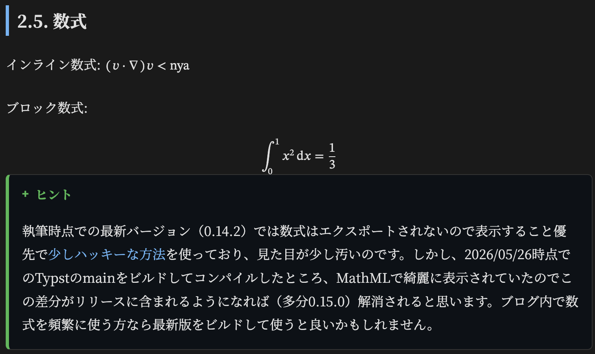
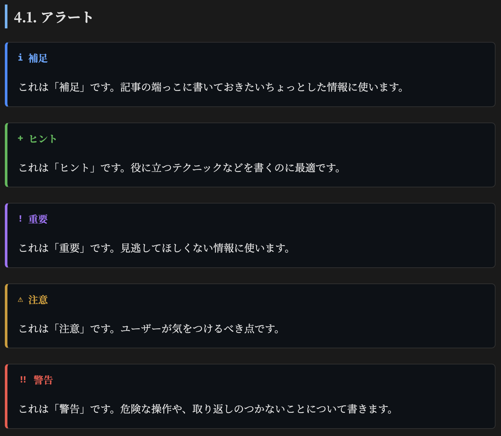

Typst良いですよね。
Markdownのように手軽に書けるのに、図表、脚注、参考文献、数式まで楽に、しかも美しく扱えるところが特に気に入っています。

ZennでもTypstの記事が増えていて、この記事を書いている2026年5月26日時点では [Typstトピックの記事数が100本](https://zenn.dev/topics/typst) になっていました。めでたい。

そんなTypstですが、0.14からHTMLエクスポート機能が実験的機能として使えるようになっています。

公式ドキュメントでも2026年5月26日時点ではまだ開発中の実験的機能という扱いで、production用途には使わないよう案内されています。実際、レイアウトや一部のHTMLまわりの挙動にはまだ未完成なところがあります。

とはいえ、Typst 0.14では多くの組み込み要素がHTMLとして出力されるようになっており、個人ブログ用途ならかなり使えるところまで来ていると感じました。

さらに手元で現在のTypstのmainブランチからビルドして試したところ、数式もMathMLを使ってWeb上で綺麗に表示されるようになっていました。例えば `$(v dot nabla) v < "nya"$` のようなインライン数式や、`integral_0^1 x^2 dif x = 1 / 3` のようなブロック数式もかなり自然に表示されます。


現行リリースだけを見るとまだ粗い部分はありますがHTMLエクスポートは今後も強化されていくだろうと期待しています。

最初はクラスレスCSSを当てて雑に使っていたのですが、記事を書いているうちに少しずつ不満が溜まっていたので自分用にCSSとビルドまわりをまとめてしまおう、ということで作ったのがこのテンプレートです。

<GitHubリポジトリURL>

この記事では、技術的な実装解説ではなく、このテンプレートで何ができるのかを紹介します。

## これは何か

TypstのHTMLエクスポートを使ってブログを書くための静的サイトテンプレートです。

記事本文はTypstで書きます。
記事のタイトル、作成日、更新日、タグ、概要などのメタデータもTypst側に置きます。
サイト名、説明文、著者情報、テーマ、フォント、共有ボタンの有無といったサイト全体の設定も `site.typ` で管理します。

あとは `build.py` を実行すると、Typstの記事をHTMLに変換しブログとして公開しやすい形にまとめます。

ざっくり言うと、Markdownベースの静的サイトジェネレーターでよく欲しくなる機能をTypstで記事を書けるように寄せたものです。

## Typstで記事を書ける

記事はディレクトリごとに `index.typ` を置く形にしています。

例えば記事の先頭はこのような感じです。

```typst
#import "../template.typ": article, calver, post-meta

#let meta = post-meta(
  slug: "my-first-post",
  title: "My First Post",
  create: calver(2026, 1, 1),
  description: "記事の短い説明文です。meta.descriptionになります。",
  tags: ("Typst",),
  draft: false,
)

#metadata(meta) <post-meta>
#show: article.with(..meta)

= はじめに

本文を書きます。
```

`slug` が公開URLになり、`title` や `description` は記事ページ、記事一覧、RSS、OGPなどに使われます。
`tags` を付けておくとタグページにも反映されます。

`draft: true` を指定した記事は、HTML出力、記事一覧、RSS、sitemapから除外されます。
まだ途中の記事をリポジトリには置いておきたいけれど公開はしたくない、というときに使えます。

上のおまじないを書いたらあとはそのままいつものようにTypstでブログを書けます。

## ブログとして必要なページを生成する

ビルドはPythonの `build.py` が担当します。

```sh
python3 build.py
```

このコマンドで、主に次のものを生成します。

- 各記事のHTML
- トップページの記事一覧
- タグ一覧ページ
- タグ別の記事一覧ページ
- RSSフィード
- sitemap
- 404ページ
- 記事ごとの画像などの静的アセット

Typst本体は現時点ではHTMLを単一ファイルとして出力します。
このテンプレートでは記事ごとにTypstをコンパイルし、`public/` 配下に静的サイトとして配置することでブログとして扱いやすい構成にしています。

記事ディレクトリ内に置いた画像、PDF、BibTeX/Hayagrivaファイルなども記事の出力先へコピーされます。
記事と素材を同じディレクトリで管理できるので記事単位でまとまりを保ちやすいです。

## GitHub Pagesですぐ公開しやすい

GitHub Pages向けのWorkflowも同梱しています。

テンプレートからリポジトリを作り、`site.typ` を自分のサイト用に編集し、GitHub PagesのSourceをGitHub Actionsに設定すれば`main` ブランチへのpushで公開できます。

Workflowでは、おおまかに次の処理を行います。

```sh
python3 build.py
npx -y pagefind --site public
```

生成された `public/` がGitHub Pagesにデプロイされます。

ローカルで確認したい場合はビルド後に普通の静的ファイルサーバーで`public/`を配信します。

```sh
python3 -m http.server 8000 -d public
```

## Pagefindでサイト内検索できる

静的サイト内検索には [Pagefind](https://pagefind.app/) を使っています。

検索インデックスは次のコマンドで生成します。

```sh
npx -y pagefind --site public
```

検索UIはサイドバーとモバイル表示に組み込んでいます。
JavaScript側では、検索欄にフォーカスしたタイミングでPagefindを読み込み検索結果を表示します。
もちろんGitHub Pagesのような静的ホスティングサイトでもちゃんと動きます。

## 記事を読むための導線

トップページには記事カードを並べます。
記事ページにはタグ、作成日、更新日、概要、目次、著者ウィジェットを表示します。
記事下には前後の記事へのリンクと別記事への導線も出します。

タグを付けた記事からは `/tags/<tag>/` のようなタグページへリンクされます。
タグ一覧ページも生成されるので記事数が増えてきても分類しやすいです。

デスクトップではサイドバーに目次を置き、モバイルでは折りたたみ式の目次を出すようにしています。

## テーマとフォントを設定できる

テーマはCSS変数で管理しています。
初期状態ではダークテーマとライトテーマを同梱しています。

`site.typ` の `theme` を変更すると、読み込むテーマCSSを切り替えられます。

```typst
theme: "light"
```

独自テーマを作る場合は、`static/themes/my-theme.css` のようにCSSファイルを追加し、`site.typ` 側で `theme: "my-theme"` を指定します。

フォント設定も `site.typ` にまとめています。本文、見出し、コード、数式、任意の追加フォントを設定でき、Web用フォントはGoogle Fontsから読み込むようにしています。

```typst
fonts: (
  main: (
    pdf: "Noto Serif CJK JP",
    web: "Noto Serif JP",
    weights: "400;700",
    fallback: "serif",
  ),
  code: (
    pdf: ("Fira Code", "Consolas", "monospace"),
    web: "Fira Code",
    weights: "300..700",
    fallback: "monospace",
  ),
)
```

Typst側で使うフォントとWeb側で読み込むフォントを同じ設定に寄せられるので、PDF出力とHTML出力を両方意識したい場合にも扱いやすいと思います。

## OGP、RSS、sitemapなども生成する

このテンプレートでは記事メタデータとサイト設定を元にRSSとsitemapを生成します。
各ページの `head` にはdescriptionやOGP用のメタタグも入れています。

Cloudflare Web Analyticsを使う場合は`site.typ` にトークンを設定するとスクリプトを読み込むようにしています。
不要なら `none` のままで大丈夫です。

```typst
analytics: (
  cloudflare_token: none,
)
```

記事への感想や誤字報告を受け取りたい場合に備えてGoogleフォームへのフィードバック導線も入れています。
フォームURLとentry IDを設定すると記事タイトル付きでフォームを開けるようにしています。

X、Misskey、タイトルと概要のコピー用ボタンも設定できます。

```typst
share: (
  x: true,
  misskey: true,
  copy: true,
)
```

## Typst記事向けの補助パーツも用意した

このテンプレートでは、次のような部品を用意しています。

- `note`
- `tip`
- `important`
- `warning`
- `caution`
- `youtube`
- `raw_html`
- `env`

例えば補足や注意を書きたいときは次のように書けます。

```typst
#note[
  これは補足です。
]

#warning[
  ここは注意して読んでください。
]
```



YouTube埋め込みはURLまたは動画IDからiframeを出せます。

```typst
#youtube("https://www.youtube.com/watch?v=eWw8HoNkVkU", start: 30)
```

どうしてもTypst側だけでは出しにくいHTMLを置きたい場合は`raw_html` が使えます。

コードブロックにはコピー用ボタンを付けています。
脚注はクリックまたはホバーで本文中にポップアップ表示します。
参考文献リンクをクリックするとサイドバーや画面下部に該当文献をプレビューします。

## 多言語UIも少しだけ意識している

サイトUIの文言は `typst/core/i18n.typ` にまとめています。

現時点では、日本語、英語、韓国語、簡体字中国語、繁体字中国語の文言を入れています。
`site.typ` の `language` を変えると、戻るボタン、目次、検索、共有、フィードバック、タグページなどのUI文言が切り替わります。

翻訳品質を完璧に保証するというよりは、テンプレートとして最低限差し替えやすい場所に集めておくという意図です。
文言を変えたい場合は自由に変えられます。

## 使い始め方

必要なものは次の通りです。

- Typst 0.14.2以上
- Python 3.10以上
- Node.js 20以上

まずこのテンプレートからリポジトリを作ります。

次に `site.typ` を自分のサイト向けに編集します。
最低限次の項目を見れば始められます。

- `title`
- `description`
- `base_url`
- `language`
- `theme`
- `author`
- `share`

記事を書くときは、`example-post/index.typ` をコピーして新しい記事ディレクトリを作るのが簡単です。

ビルドします。

```sh
python3 build.py
npx -y pagefind --site public
```

ローカルで確認します。

```sh
python3 -m http.server 8000 -d public
```

GitHub Pagesで公開する場合は、GitHubの `Settings` からPagesのSourceをGitHub Actionsに設定し、`main` ブランチへpushします。

## まだ実験的なものとして楽しむ

TypstのHTMLエクスポートは公式にもまだ実験的な機能として扱われています。

このテンプレートもその上に乗っているものなので今後のTypstの変更で調整が必要になる可能性はあります。
特にHTML出力まわりや数式まわりは今後さらに変わっていくはずです。

ただ、個人ブログとして使うにはすでにかなり面白いところまで来ています。
MarkdownではなくTypstで文章を書きたい人、Typstの参照や文献管理の書き味が好きな人、HTMLエクスポートを使って何か作ってみたい人はよければ触ってみてほしいです。

参考:

- [HTML - Typst Documentation](https://typst.app/docs/reference/html/)
- [Typst 0.14.0 Changelog](https://typst.app/docs/changelog/0.14.0/)
